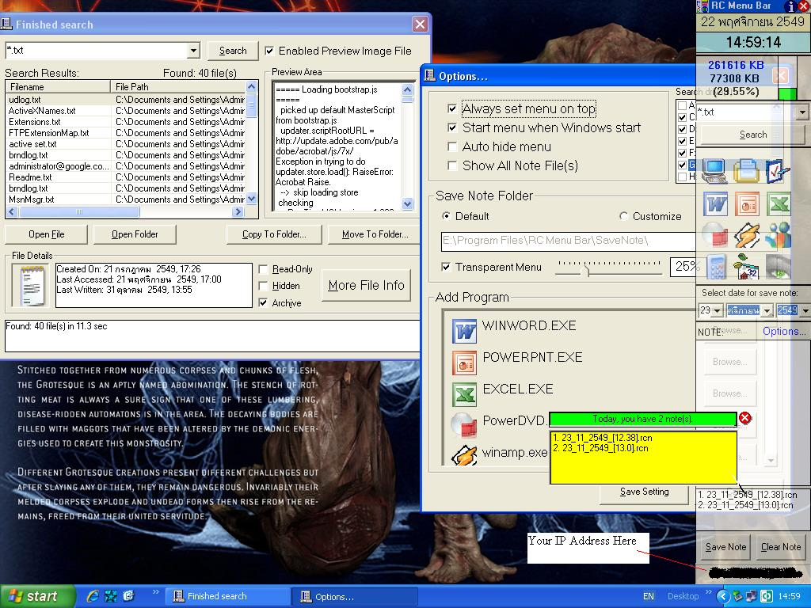



## RC Menu Bar 2\.3\.5 \(Latest Updated\!\!\)

### Description

This is a program that can help you to remind yourself. Create a short cut of any program you frequency use. Search function with open file, open folder, copy to folder, move to folder, preview text (*.txt) files, image files such as JPEG, JPG, BMP, PNG, GIF animation, file details, and so many cool API functions. For GIF animation viewer, I use an "Animation GIF Control" (anigif.ocx) that you can find here --&gt; http://www.afreeocx.com/ocx/info/anigif_ocx.html

or http://www.jcomsoft.com/anigif.htm &lt;--- Furthermore, you can set always on top of menu bar, set transparent, extract icon from file, view your IP address and so many function. Included read and write registry by using API function, check any program are running and kill program that running by using kill process function, and so on ...

---&gt;&gt; I got many function from PSC, so some function I still remain the same as original but some I modified for my program. Thank you PSC for many useful code &lt;&lt;---
 
### More Info
 

             |
---                |---
**Submitted On**   |2006-11-22 23:02:32
**By**             |[RaChanR](https://github.com/Planet-Source-Code/PSCIndex/blob/master/ByAuthor/rachanr.md)
**Level**          |Intermediate
**User Rating**    |4.7 (14 globes from 3 users)
**Compatibility**  |VB 4\.0 \(32\-bit\), VB 5\.0, VB 6\.0
**Category**       |[Complete Applications](https://github.com/Planet-Source-Code/PSCIndex/blob/master/ByCategory/complete-applications__1-27.md)
**World**          |[Visual Basic](https://github.com/Planet-Source-Code/PSCIndex/blob/master/ByWorld/visual-basic.md)
**Archive File**   |[RC\_Menu\_Ba20326311232006\.zip](https://github.com/Planet-Source-Code/rachanr-rc-menu-bar-2-3-5-latest-updated__1-67155/archive/master.zip)

